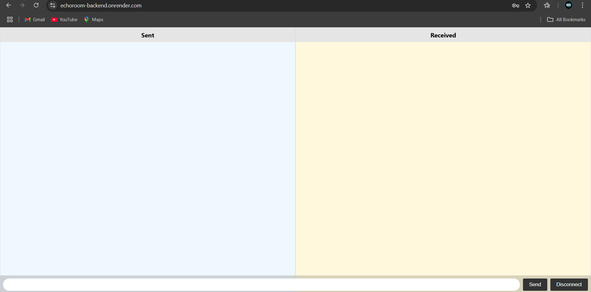

# 🌑 **ShadowTalk**  
**A Secure, Anonymous, and Real-Time Chat Platform**  

## 📖 **Overview**  
**ShadowTalk** is a secure and anonymous chat application designed for real-time communication. With its user-friendly interface and focus on privacy, it ensures:  
- 🔒 **Password-Protected Access**: Only authorized users can join the chat.  
- 🕵️ **Anonymity**: No user identifiers are shown—messages are simply categorized as **Sent** or **Received**.  
- 📱 **Mobile-Responsive Design**: Works seamlessly across all devices.  

---

## 🛠️ **Features**  

### 🏷️ Core Features:  
1. **Secure Authentication**  
   - Access is restricted to users with the correct password.  

2. **Anonymous Chat**  
   - No names or IDs are displayed; conversations are private and nameless.  

3. **Real-Time Messaging**  
   - Powered by Socket.IO for instant message delivery between users.  

4. **Sent & Received Sections**  
   - Clear separation of messages you send from those you receive.  

5. **Responsive Design**  
   - Fully optimized for desktops, tablets, and mobile devices.  

---

## 🖥️ **Tech Stack**  

### **Frontend**  
- HTML5  
- CSS3  
- Vanilla JavaScript  

### **Backend**  
- Node.js  
- Express.js  

### **Real-Time Communication**  
- Socket.IO  

---

## 🚀 **Getting Started**  

### **Prerequisites**  
Ensure you have the following installed:  
- Node.js (v14 or higher)  
- npm (Node Package Manager)  

### **Installation**  
  
```bash  
#Clone the repository and install dependencies:
git clone https://github.com/your-username/shadowtalk.git  
cd shadowtalk  
npm install  
#Start the server:
node index.js  
#Access the chat application at:
http://localhost:3000  
```


## 🔑 **How to Use ShadowTalk**  
1. Open the application in your browser.  
2. Authenticate using the predefined password.  
3. Start chatting:  
   - Messages you send appear in the **Sent** section.  
   - Messages received from others appear in the **Received** section.  
4. To disconnect, click the **Disconnect** button.  

---

## 📸 **Screenshot**  
### Main Chat Interface  
  

## 🌐 **Live Deployed Link**  
[Click here to access ShadowTalk](https://echoroom-backend.onrender.com/)  
(If you need the password to enjoy this app in real-time, then connect with me !!!)

---

## 🛡️ **Security Notes**  
- Use a strong password for accessing the chat.  
- ShadowTalk does not store user data or chat histories.  
